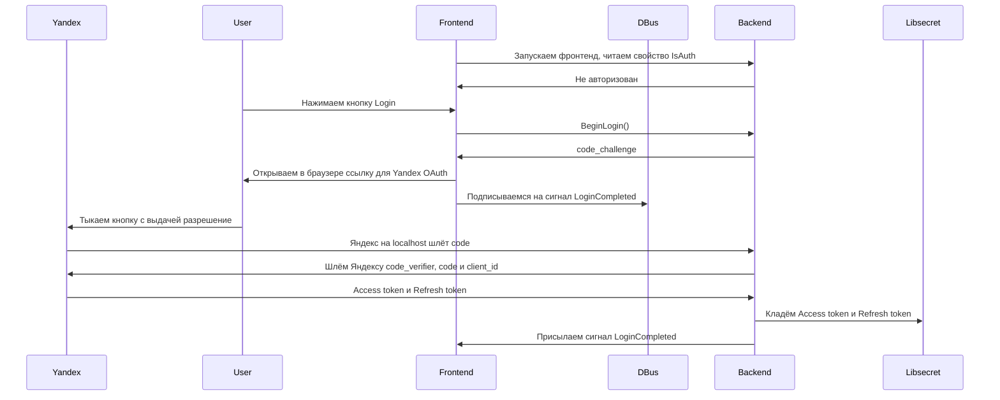

# discohack26

```mermaid
sequenceDiagram
    participant Y as Yandex
    participant U as User
    participant F as Frontend
    participant D as DBus
    participant B as Backend
    participant S as Libsecret

    F->>B: Запускаем фронтенд, читаем свойство IsAuth
    B->>F: Не авторизован
    U->>F: Нажимаем кнопку Login
    F->>B: BeginLogin()
    B->>F: code_challenge
    F->>U: Открываем в браузере ссылку для Yandex OAuth
    F->>D: Подписываемся на сигнал LoginCompleted
    U->>Y: Тыкаем кнопку с выдачей разрешение
    Y->>B: Яндекс на localhost шлёт code
    B->>Y: Шлём Яндексу code_verifier, code и client_id
    Y->>B: Access token и Refresh token
    B->>S: Кладём Access token и Refresh token
    B->>F: Присылаем сигнал LoginCompleted
```